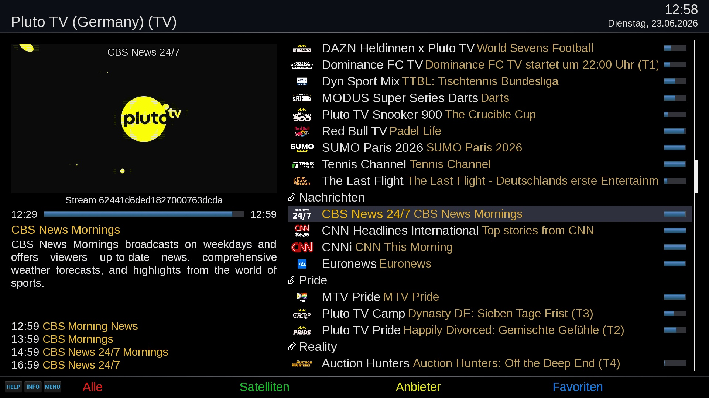
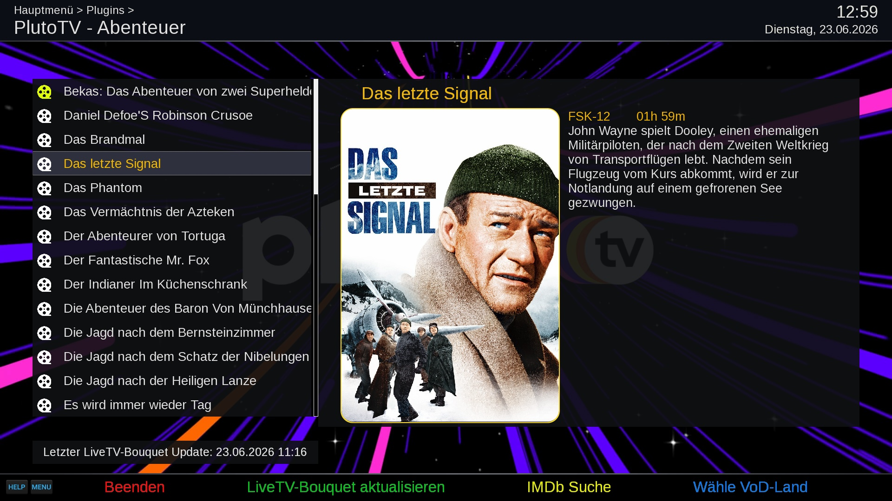
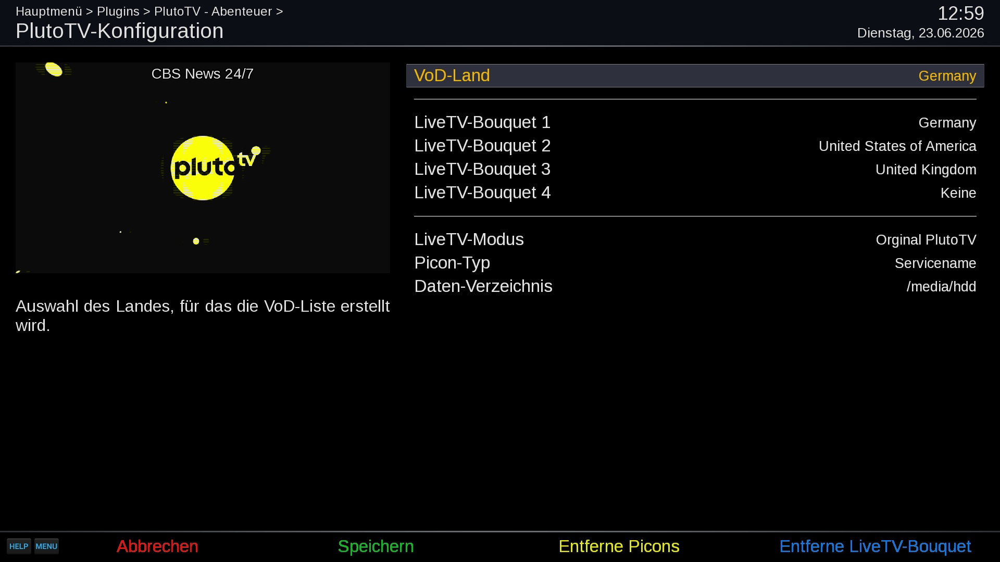

# PlutoTVCockpit (PTV)
Open-Enigma2 plugin for Live-TV and VoD streams

## Live-TV

## Video-On-Demand

## Configuration

## Features
- Playback of Pluto TV live channels and VoD content by country
- Generation of E2 bouquets including EPG
- Download of channel picons
- Record channels - instant and timer recording

## Disclaimer
The project author is not responsible for how this software is used by others. It is not intended to be used for accessing or distributing copyrighted materials without authorization.
Users are solely responsible for determining the legality of their actions.

This repository has no control over the streams, links, or the legality of the content provided by the different hosts (including all mirror sites). It is the end user's responsibility to ensure the legal use of these streams, and we strongly recommend verifying that the content complies with all applicable laws, including copyright laws and regulations of your country's jurisdiction before use.

## Limitations
- PlutoTVCockpit supports OpenViX and compatible distributions.

## Links
- Installation: https://OpenCockpit.github.io/PlutoTVCockpit
